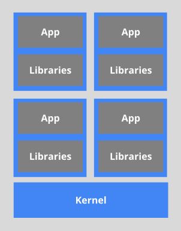

# 将用户连接到pods中

要访问该应用程序，用户/客户端需要连接到Pod。由于Pod本质上是短暂的，分配给它的IP地址等资源不能是静态的。Pod可以突然终止，也可以根据现有要求重新安排。

让我们以一个场景为例，其中用户/客户端使用其IP地址连接到Pod。

出乎意料的是，终止了与用户/客户端连接的Pod，并且控制器创建了新的Pod。新的Pod将具有一个新的IP地址，早期的Pod的用户/客户端将不会自动知道该IP地址。

为了克服这种情况，Kubernetes提供了一个称为Service的更高级别的抽象，该抽象将Pod进行逻辑分组并定义访问它们的策略。通过Label和Selector可以实现此分组。

