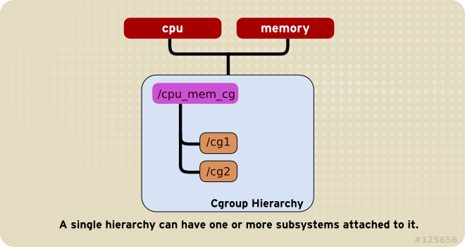

# Cgroups

## CGroups

> _References：_ Wiki Cgroups: [https://zh.wikipedia.org/wiki/Cgroups](https://zh.wikipedia.org/wiki/Cgroups)
>
> RedHat Cgroups 简介: [https://access.redhat.com/documentation/zh-cn/red\_hat\_enterprise\_linux/7/html/resource\_management\_guide/index](https://access.redhat.com/documentation/zh-cn/red_hat_enterprise_linux/7/html/resource_management_guide/index)
>
> Borg, Omega, and Kubernetes: [https://queue.acm.org/detail.cfm?id=2898444](https://queue.acm.org/detail.cfm?id=2898444)

### Brief

`cgroups`，其名称源自控制组群（`control groups`）的简写，是Linux内核的一个功能，用来限制、控制与分离一个行程组群的资源（如CPU、内存、磁盘输入输出等）。

`cgroups`的一个设计目标是为不同的应用情况提供统一的接口，从控制单一进程（像`nice`）到操作系统层虚拟化（像OpenVZ，Linux-VServer，LXC）。

### Rules

#### 1. 子系统（subsystem，指的是资源控制子系统）无法附加到不同层级中

`cpu和内存`子系统永远无法附加到两个不同的层级。单一层级可附加一个或者多个子系统。




```text
cpu 和 memroy子系统（或者任意数目的子系统）都可附加到单一层级中，只要每个子系统不再附加到另一个层级。就是一个子系统只能控制一个层级，不能控制多个层级。
```

**2. 一个任务永远不会同时位于同一层级的不同cgroup中**

每次在系统中创建新层级时，该系统中的所有任务都是那个层级的默认 cgroup（我们称之为 root cgroup）的初始成员。对于创建的任何单一层级，该系统中的每个任务都可以是那个层级中唯一一个 cgroup 的成员。单一任务可以是在多个 cgroup 中，只要每个 cgroup 都在不同的层级中即可。只要某个任务成为同一层级中第二个 cgroup 的成员，就会将其从那个层级的第一个 cgroup 中删除。一个任务永远不会同时位于同一层级的不同 cgroup 中。


```text
如果 cpu 和 memory 子系统都附加到名为 cpu_and_mem 的层级中，且 net_cls 子系统是附加到名为 net 的层级中，那么运行的 httpd 进程可以是 cpu_and_mem 中任意 cgroup 的成员，同时也是 net 中任意 cgroup 的成员。
httpd 进程所在 cpu_and_mem 中的 cgroup 可将其 CPU 时间限制为分配给其它进程时间的一半，并将其内存用量限制为最多 1024 MB。另外，net 中的 cgroup 还可将其传输速率限制为 30 MB/秒。
首次创建层级时，该系统中的每个任务都至少是一个 cgroup 的成员，即 root cgroup。因此每当使用 cgroup 时，每个系统任务总是至少在一个 cgroup 中。
```

#### 3. 子任务可以在不同的cgroup之间移动

该系统中的任意进程（任务）都将自己分支创建子进程（任务）。该子任务自动成为其父进程所在 cgroup 的成员。然后可根据需要将该子任务移动到不同的 cgroup 中，但开始时它总是继承其父任务的 cgroup（进程术语中称其为“环境”）。


```text
cpu_and_mem 层级中名为 half_cpu_1gb_max 的 cgroup 成员的任务，以及 net 层级中 cgroup trans_rate_30 的成员。当 httpd 进程将其自身分成几个分支时，其子进程会自动成为 half_cpu_1gb_max cgroup 和 trans_rate_30 cgroup 的成员。它会完全继承其父任务所属的同一 cgroup。
然后，任务和子任务就彼此完全独立：更改某个任务所属 cgroup 不会影响到另一个。同样更改父任务的 cgroup 也不会以任何方式影响其子任务。总之：所有子任务总是可继承其父任务的同一 cgroup 的成员关系，但之后可更改或者删除那些成员关系。
```

### Cgroup 默认层级

1. `slice` —— 一组按层级排列的单位。slice 并不包含进程，但会组建一个层级，并将 scope 和 service 都放置其中。真正的进程包含在 scope 或 service 中。在这一被划分层级的树中，每一个 slice 单位的名字对应通向层级中一个位置的路径。小横线（"-"）起分离路径组件的作用。例如，如果一个 slice 的名字是：

   ```text
    parent-name.slice
   ```

2. `service` —— 一个或一组进程，由 systemd 依据单位配置文件启动。service 对指定进程进行封装，这样进程可以作为一个整体被启动或终止。service 参照以下方式命名：

```text
    name.service
```

1. `scope` —— 一组外部创建的进程。由强制进程通过 fork\(\) 函数启动和终止、之后被 systemd 在运行时注册的进程，scope 会将其封装。例如：用户会话、 容器和虚拟机被认为是 scope。scope 的命名方式如下：

   ```text
   name.scope
   ```

下面是一个CentOS 7.6里面的Cgroup信息：

```text
    [root@localhost ~]# systemd-cgls
    ├─1 /usr/lib/systemd/systemd --switched-root --system --deserialize 22
    ├─user.slice
    │ └─user-0.slice
    │   ├─session-5.scope
    │   │ ├─7862 sshd: root@pts/0    
    │   │ ├─7871 -bash
    │   │ ├─8938 systemd-cgls
    │   │ └─8939 systemd-cgls
    │   └─session-4.scope
    │     ├─6664 login -- root     
    │     └─7821 -bash
    └─system.slice
      ├─docker.service
      │ ├─7976 /usr/bin/dockerd-current --add-runtime docker-runc=/usr/libexec/docker/docker-runc-current --default-runtime=docker-runc --exec-opt native.cgroupdriver=sys
      │ └─7981 /usr/bin/docker-containerd-current -l unix:///var/run/docker/libcontainerd/docker-containerd.sock --metrics-interval=0 --start-timeout 2m --state-dir /var/
      ├─rsyslog.service
      │ └─7198 /usr/sbin/rsyslogd -n
      ├─tuned.service
      │ └─7196 /usr/bin/python2 -Es /usr/sbin/tuned -l -P
      ...
```

#### Cgroup资源控制器

Cgroup可以控制如下的资源分配共享到不同的层级中，Red Hat Enterprise Linux 中的可用子系统，或者叫可管控的系统资源管理器如下：

* **blkio -- 这个子系统为块设备设定输入/输出限制，比如物理设备（磁盘，固态硬盘，USB 等等）。**
* **cpu -- 这个子系统使用调度程序提供对 CPU 的 cgroup 任务访问。**
* **freezer -- 这个子系统挂起或者恢复 cgroup 中的任务。**
* **memory -- 这个子系统设定 cgroup 中任务使用的内存限制，并自动生成由那些任务使用的内存资源报告。**
* **net\_cls -- 这个子系统使用等级识别符（classid）标记网络数据包，可允许 Linux 流量控制程序（tc）识别从具体 cgroup 中生成的数据包。**
* **ns -- 名称空间子系统。**
* cpuacct -- 这个子系统自动生成 cgroup 中任务所使用的 CPU 报告。
* cpuset -- 这个子系统为 cgroup 中的任务分配独立 CPU（在多核系统）和内存节点。
* devices -- 这个子系统可允许或者拒绝 cgroup 中的任务访问设备。

#### Cgroup怎么限制资源使用的

通过查看和修改\*.service文件，我们就可以限制以上资源的使用情况，例如：

```text
[root@localhost system]# cat docker.service
[Unit]
Description=Docker Application Container Engine
Documentation=http://docs.docker.com
After=network.target
Wants=docker-storage-setup.service
Requires=docker-cleanup.timer

[Service]
Type=notify
NotifyAccess=main
EnvironmentFile=-/run/containers/registries.conf
EnvironmentFile=-/etc/sysconfig/docker
EnvironmentFile=-/etc/sysconfig/docker-storage
EnvironmentFile=-/etc/sysconfig/docker-network
Environment=GOTRACEBACK=crash
Environment=DOCKER_HTTP_HOST_COMPAT=1
Environment=PATH=/usr/libexec/docker:/usr/bin:/usr/sbin
ExecStart=/usr/bin/dockerd-current \
          --add-runtime docker-runc=/usr/libexec/docker/docker-runc-current \
          --default-runtime=docker-runc \
          --exec-opt native.cgroupdriver=systemd \
          --userland-proxy-path=/usr/libexec/docker/docker-proxy-current \
          --init-path=/usr/libexec/docker/docker-init-current \
          --seccomp-profile=/etc/docker/seccomp.json \
          $OPTIONS \
          $DOCKER_STORAGE_OPTIONS \
          $DOCKER_NETWORK_OPTIONS \
          $ADD_REGISTRY \
          $BLOCK_REGISTRY \
          $INSECURE_REGISTRY \
          $REGISTRIES
ExecReload=/bin/kill -s HUP $MAINPID
LimitNOFILE=1048576
LimitNPROC=1048576
LimitCORE=infinity
TimeoutStartSec=0
Restart=on-abnormal
KillMode=process

[Install]
WantedBy=multi-user.target
```

这里我们可以看到

